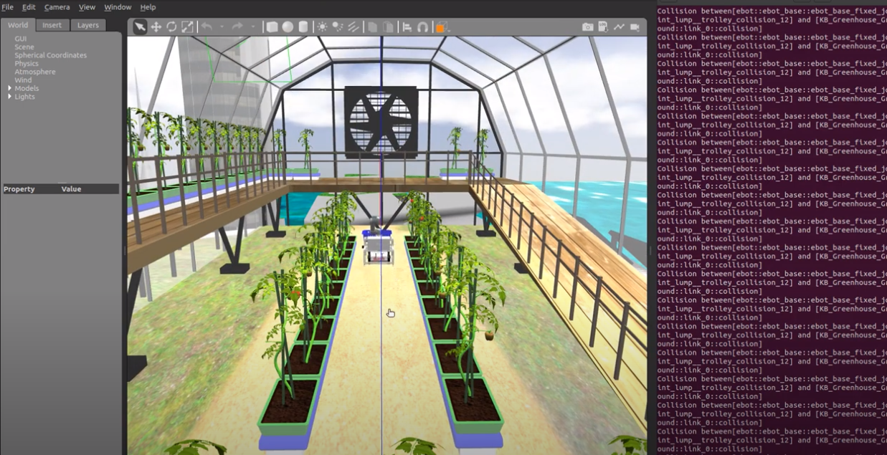

# Project Title: KrishiBot - An Autonomous Farming Bot

## Project Details

This project was part of our competition at eyantra. Where we developed an Autonomous Farming Bot using ROS1 and Navigation Stack

### Getting Started:

To get started with RoboRover, follow these steps:

1. **Hardware Setup:** Connect the sensors, actuators, and other components according to the provided documentation.

2. **Software Installation:** Install the required dependencies and ROS packages. Detailed instructions can be found in the `docs` directory.

3. **Launch the System:** Run the provided launch scripts to start the robot's system. Monitor the output to ensure proper initialization.

4. **Autonomous Mode:** Place the robot in a controlled environment and observe its autonomous navigation capabilities. Adjust parameters and fine-tune algorithms as needed.

